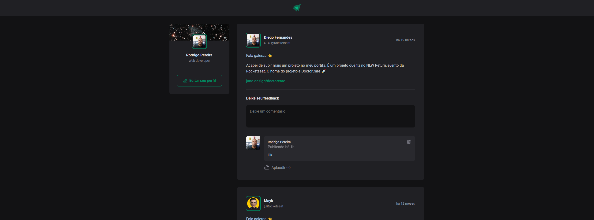

<h1 align="center">POST</h1>

<h1 align="center">
    <a href="https://pt-br.reactjs.org/">🔗 React</a>
</h1>

<p align="center"> 
    
</p>

<p align="center">🚀 Site desenvolvido a fins de conhecimento, trata-se se post onde é possível curtir, comentar e deletar</p>

# TECNOLOGIAS 
<ul>
  <li>react</li>
  <li>date-fns</li>
  <li>phosphor-react</li>
</ul>

#CONFIGURAÇÃO DO PROJETO
```
# Abra o terminal e clone o repositório com o comando
git clone https://github.com/rodrigopfialho/post

No terminal digite os seguintes comando.

npm i

npm run dev
```
<span>O projeto estará disponivel no  http://localhost:3000</span>


